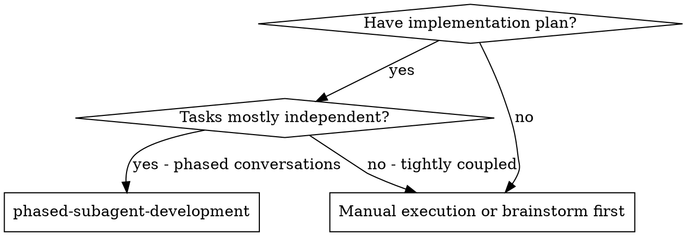
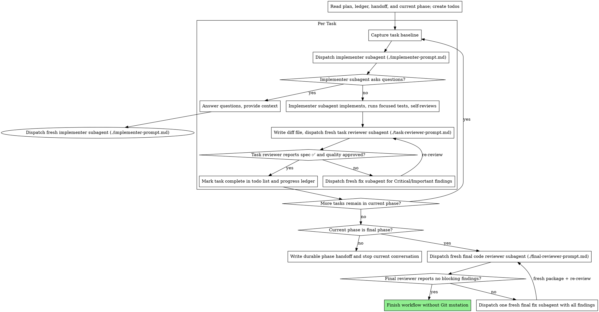

# Phased Subagent Development

Execute one plan phase per primary conversation by dispatching a fresh subagent for every implementation, fix, and review, with a task review (spec compliance + code quality) after each task and a broad whole-change review after the final phase.

**Why subagents:** You delegate tasks to specialized agents with isolated context. By precisely crafting their instructions and context, you ensure they stay focused and succeed at their task. They should never inherit your session's context or history — you construct exactly what they need. This also preserves your own context for coordination work.

**Core principle:** Fresh subagent per dispatch + task review (spec + quality) + durable phase handoff + broad final review = high-assurance sequential execution across clean primary conversations

**Narration:** between tool calls, narrate at most one short line — the
ledger and the tool results carry the record.

**Continuous execution:** Do not pause to check in with your human partner between tasks in the current phase. Execute the phase without stopping. The only reasons to stop are: BLOCKED status you cannot resolve, ambiguity that genuinely prevents progress, the current phase is complete, or the whole plan is complete. At a non-final phase boundary, write the durable handoff and stop so a fresh primary conversation can execute the next phase. Do not ask "Should I continue?" inside a phase.

## Primary Conversation Phases

Use one fresh primary conversation per plan phase. A phase contains one or more
complete tasks; never hand work off while a task implementation, fix, or review
is still in progress.

At the end of a non-final phase:

1. Confirm every task in the phase passed its task review gate.
2. Append the phase result and next phase to `progress.md`.
3. Append a concise section to `<workspace>/phase-handoff.md` containing only
   cross-phase interfaces and decisions, unresolved Minor findings or concerns,
   and the exact next phase and task.
4. Return a short handoff telling the human to start a fresh primary
   conversation with the same plan and worktree. Do not run the final
   whole-change review yet.

In the fresh primary conversation, invoke this skill again. Verify the plan,
ledger, baselines, reports, and review artifacts as described under Durable
Progress; read `phase-handoff.md`; then resume the next phase. Do not re-dispatch
completed phases or tasks. Only one primary conversation may control the
worktree at a time.

## Subagent Lifecycle

Use a fresh subagent with isolated context for every dispatch. Never reuse an
implementer, fixer, or reviewer. When the agent API supports context-fork
control, disable inherited conversation context (for example,
`fork_turns="none"`).

The root controller continues to delegate implementation, fixes, and reviews
to fresh first-level subagents as required by this workflow. Nested subagents
are forbidden: an implementer, fixer, task reviewer, or final reviewer must
not spawn a child agent or delegate its assigned work to another agent. Its
self-review or review work must be performed directly in its own dispatch. A
child agent never replaces a controller-dispatched review gate.

Persist context through files, not agent reuse:

- The implementer writes the task report.
- Every task reviewer writes its complete findings to a unique review report
  file (`task-N-review-<cycle>.md`).
- A fresh fixer reads the brief, task report, review package, failed review
  report, and named covering tests.
- The fixer appends its changes and test evidence to the same report.
- A fresh reviewer reads the updated artifacts and performs the re-review.

Never send a follow-up task to a previously used implementer, fixer, or
reviewer.

If a subagent asks a question, that dispatch ends. Answer the question, append
the answer to that task's brief under `## Controller Resolutions`, then
dispatch a fresh subagent that reads the updated brief. The task reviewer uses
that same brief, so it reviews against the resolved requirement. Never resume
or reuse the subagent that asked.

## When to Use



This workflow is phase-scoped. Each phase runs continuously in one primary
conversation; later phases resume in fresh primary conversations through the
durable ledger and handoff file.

This workflow deliberately spends at least two subagent dispatches per task
plus a final review. Use it only when each task is substantial enough to
justify an independent review gate; use direct execution for small changes.

Only one SDD controller may operate in a worktree at a time. This workflow
does not implement a lock. Do not start or resume it while another SDD run is
editing the same worktree; if that is uncertain, stop and ask the human.

## Plan Format Contract

Plans used by this skill use the writing-plans canonical English headings:

```markdown
## Global Constraints
## Phase 1: Foundation
### Task 1: Component Name
```

For compatibility, `scripts/task-brief` also accepts `## Task 1`. It does not
recognize translated headings such as `任务 1` or `全局约束`.

Use canonical `## Phase N: Name` headings to enable primary-conversation
handoffs. Every task must belong to exactly one phase, phase numbers must be
unique and consecutive, and task numbers remain unique and consecutive across
the whole plan. A legacy plan without Phase headings is treated as one phase
and therefore has no intermediate primary-conversation handoff.

## The Process



## Pre-Flight Plan Review

Before creating the SDD workspace or dispatching Task 1, inspect the current
Git branch using a read-only command. If it is `main` or `master`, stop and ask
the human for explicit consent to implement on that branch. Do not create the
workspace or begin implementation until consent is given. On any other branch,
continue with the plan review.

Then scan the plan once for conflicts:

- tasks that contradict each other or the plan's Global Constraints
- anything the plan explicitly mandates that the review rubric treats as a
  defect (a test that asserts nothing, verbatim duplication of a logic block)
- missing or duplicate canonical `### Task N: Name` (or legacy `## Task N`)
  and exact `## Global Constraints` headings
- missing, duplicate, non-consecutive, or empty canonical `## Phase N: Name`
  headings when the plan is intended to span primary conversations; tasks
  outside a phase are also invalid in a phased plan

Present everything you find to your human partner as one batched question —
each finding beside the plan text that mandates it, asking which governs —
before execution begins, not one interrupt per discovery mid-plan. If the
scan is clean, proceed without comment. The review loop remains the net for
conflicts that only emerge from implementation.

Record every human decision that changes or resolves a requirement in the
affected task brief under `## Controller Resolutions` before dispatching its
implementer. Keep the resolved brief path in the ledger so task and final
reviewers read the same requirement source.

## Model Selection

Do not specify a model when dispatching a subagent. Every subagent inherits
the main conversation's default model configuration. The dispatch API may not
expose or guarantee an exact underlying model identifier, so do not claim that
it does.

## Handling Implementer Status

Implementer subagents report one of four statuses. Handle each appropriately:

**DONE:** Confirm the report names every changed file and contains focused-test
evidence. For every production-code change, also confirm the report contains
the required RED command/failure and GREEN command/passing output. Generate the review package with
`scripts/review-package --from BASELINE_FILE -- PATH...`, passing the baseline
captured immediately before this task and exactly the reported paths. The
script prints the unique file path it wrote. Then dispatch the task reviewer
with that package.

**DONE_WITH_CONCERNS:** The implementer completed the work but flagged doubts. Read the concerns before proceeding. If the concerns are about correctness or scope, address them before review. If they're observations (e.g., "this file is getting large"), note them and proceed to review.

**NEEDS_CONTEXT:** The implementer needs information that wasn't provided. Provide the missing context and dispatch a fresh implementer.

**BLOCKED:** The implementer cannot complete the task. Assess the blocker:
1. If it's a context problem, provide more context and dispatch a fresh implementer
2. If the task requires more reasoning, refine the brief or break it into smaller pieces
3. If the task is too large, break it into smaller pieces
4. If the plan itself is wrong, escalate to the human

**Never** ignore an escalation or force an unchanged retry. If the implementer
said it's stuck, something needs to change.

## Handling Reviewer ⚠️ Items

The task reviewer may report "⚠️ Cannot verify from diff" items — requirements
that live in unchanged code or span tasks. These do not block the rest of the
review, but you must resolve each one yourself before marking the task
complete: you hold the plan and cross-task context the reviewer
lacks. If you confirm an item is a real gap, treat it as a failed spec
review — dispatch a fresh fixer and then a fresh reviewer.

## Constructing Reviewer Prompts

Per-task reviews are task-scoped gates. The broad review happens once, at the
final whole-change review. When you fill a reviewer template:

- Do not add open-ended directives like "check all uses" or "run race tests
  if useful" without a concrete, task-specific reason
- Ask the reviewer to independently re-run exactly one smallest safe focused
  GREEN test command for a production-code task. Do not ask it to repeat RED,
  a full suite, or broader validation already covered by the report.
- Do not pre-judge findings for the reviewer — never instruct a reviewer to
  ignore or not flag a specific issue. If you believe a finding would be a
  false positive, let the reviewer raise it and adjudicate it in the review
  loop. If the prompt you are writing contains "do not flag," "don't treat X
  as a defect," "at most Minor," or "the plan chose" — stop: you are
  pre-judging, usually to spare yourself a review loop.
- The task brief is the shared requirements source for implementer and
  reviewer. `scripts/task-brief` appends the plan's complete Global
  Constraints section to the task text, including exact values, formats,
  and stated relationships between components ("same layout as X", "matches
  Y"). Do not give the reviewer extra requirements the implementer never saw.
- Hand the reviewer its diff as a file: run this skill's
  `scripts/review-package --from BASELINE_FILE -- PATH...`, passing the task's
  start baseline and the cumulative union of every changed path listed in the
  task report across the implementer and all fixer entries, then pass the
  printed package path to the reviewer. The package
  contains only the delta since that task began, even when earlier tasks
  changed the same files. Snapshotting uses a private index and object store;
  it never changes the repository's real index, HEAD, refs, or object store.
  The output never enters your own context.
- Give every task reviewer a unique review report path. The reviewer writes
  its complete verdict and findings there, then returns only a short verdict
  summary and the report path. A re-review gets a new path; never overwrite a
  prior failed review.
- A dispatch prompt describes one task, not the session's history. Do not
  paste accumulated prior-task summaries ("state after Tasks 1-3") into
  later dispatches — a real session's dispatch hit 42k chars of which 99%
  was pasted history. A fresh subagent needs its task, the interfaces it
  touches, and the global constraints. Nothing else.
- Dispatch fresh fix subagents for Critical and Important findings. Record
  whether Minor findings remain plus the review report path in the progress
  ledger, so the final whole-change reviewer reads their complete details and
  triages which must be fixed before human handoff.
- A spec-compliance failure is always Critical or Important. `Task quality:
  Needs fixes` means at least one Critical or Important finding exists. Minor
  findings alone do not block task completion.
- A finding labeled plan-mandated — or any finding that conflicts with
  what the plan's text requires — is the human's decision, like any plan
  contradiction: present the finding and the plan text, ask which governs.
  Do not dismiss the finding because the plan mandates it, and do not
  dispatch a fix that contradicts the plan without asking.
- The final whole-change review gets a package too: run
  `scripts/review-package --from RUN_BASELINE` with no path list and include
  the printed path in the final review dispatch. It contains only changes
  made since this SDD run began, including files that became untracked, without
  changing Git state.
- Every fix dispatch uses a fresh subagent and carries the implementer contract: the fix subagent
  reads the failed review report, re-runs the tests covering its change, and
  reports the results. Name the covering test files in the dispatch — a
  one-line fix does not need the whole suite. Before dispatching a fresh
  reviewer, confirm the fix report contains the covering tests, the command
  run, and the output. Generate the re-review package from the original task
  baseline using the cumulative union of implementer and fixer paths, then
  dispatch a fresh reviewer once all evidence is present.
- If the final whole-change review returns findings, write its complete output
  to a uniquely named final-findings file and dispatch ONE fresh fix subagent
  with that file — not one fixer per finding. Give the fixer a separate,
  uniquely named final-fix report file for its changes and test evidence.
  Per-finding fixers each rebuild context and re-run focused tests; a real
  session's final-review fix wave cost more than all its tasks combined.
- After that fixer reports completion and test evidence, generate a fresh
  `scripts/review-package --from RUN_BASELINE` package and dispatch a fresh
  final whole-change reviewer with the prior final-findings file and final-fix
  report file.
  Require the reviewer to disposition every prior Critical and Important
  finding. Repeat this fix and re-review loop until the final reviewer reports
  no blocking findings. Never finish based only on the fixer's self-report.
- After the final reviewer reports no blocking findings, use
  `verification-before-completion` and run fresh verification relevant to the
  whole completed change before claiming completion. Do not run the full suite
  unless the human explicitly requested it.

## File Handoffs

Everything you paste into a dispatch prompt — and everything a subagent
prints back — stays resident in your context for the rest of the session
and is re-read on every later turn. Hand artifacts over as files:

- **Task brief:** before dispatching an implementer, run this skill's
  `scripts/task-brief PLAN_FILE N` — it extracts the task's full text plus
  the plan's complete Global Constraints section to a stable task-scoped file
  and prints the path. Compose the dispatch so the
  brief stays the single source of requirements. Your dispatch should
  contain: (1) one line on where this task fits in the project; (2) the
    brief path, introduced as "read this first — it is your requirements,
    with the exact values to use verbatim"; (3) interfaces and decisions
    from earlier tasks that the brief cannot know; (4) your resolution of
    any ambiguity you noticed, already appended to the brief under
    `## Controller Resolutions`; (5) the report-file path and report contract.
    Exact values (numbers, magic strings, signatures, test cases) appear only
    in the brief.
- **Task baseline:** immediately before dispatching the first implementer for
  a task, run `scripts/review-package --start` and retain the printed baseline
  path. Reuse that same baseline for every review and re-review of this task.
  Record it in the progress ledger before dispatch so compaction cannot lose
  it. Capture a new baseline only when moving to the next task.
- **Report file:** name the implementer's report file after the brief
  (brief `…/task-N-brief.md` → report `…/task-N-report.md`) and put it in
  the dispatch prompt. The implementer writes the full report there and
  returns only status, changed files, a one-line test summary, and concerns.
- **Review report:** give each task review and re-review a unique path such as
  `…/task-N-review-1.md`. The reviewer writes its complete output there and
  returns only the verdict summary plus that path. A fixer reads the latest
  failed review report instead of receiving pasted findings.
- **Phase handoff:** use the stable append-only path
  `<workspace>/phase-handoff.md`. At each completed non-final phase, append the
  phase number, completed tasks, cross-phase interfaces and decisions, open
  Minor findings or concerns, and the exact next phase and task. Keep it
  concise; do not copy task reports or review findings already named in
  `progress.md`.
- **Reviewer inputs:** the task reviewer gets four paths — the same brief file
  the implementer read, the task report, the review package, and its unique
  review report output path. Do not add a separate constraints block that can
  drift from the shared brief.
- Fix dispatches append their fix report (with test results) to the same
  report file and return a short summary; re-reviews read the updated file.

## Durable Progress

Conversation memory does not survive compaction or a switch to a fresh primary
conversation. In real sessions,
controllers that lost their place have re-dispatched entire completed task
sequences — the single most expensive failure observed. Track progress in
a ledger file, not only in todos.

- After the branch check, any required main/master consent, and the pre-flight
  plan review, resolve the workspace directory with `scripts/sdd-workspace`.
  Compute the plan's canonical absolute path and SHA-256 before checking the
  ledger at `<workspace>/progress.md`.
- If `progress.md` does not exist, this is a fresh run. Capture a run baseline
  with `scripts/review-package --start`, then create the ledger with
  `Plan: <canonical path>`, `Plan SHA-256: <hash>`,
  `Run baseline: <path>`, and `Current phase: 1` header lines. Then begin with
  the first task in Phase 1.
- If `progress.md` exists, first require both plan header values to match the
  current plan. A mismatch means this is a different or changed plan: stop and
  ask the human whether to archive the old SDD workspace and start fresh.
  Never reuse the old task records for a mismatched plan.
- With matching plan identity, this is a resumed run. Tasks and phases listed
  there as complete are DONE. Verify every baseline, brief, task report, review
  package, review report, and named phase handoff exists. Read
  `phase-handoff.md`, then resume the first incomplete task in the current
  phase. If its latest ledger entry names a failed review, resume with a fresh
  fixer reading that review report; do not re-dispatch the implementer. Do not
  re-dispatch completed phases or tasks. A legacy ledger without a run baseline
  cannot safely exclude pre-existing changes from final review; ask the human
  to archive it and start a fresh run.
- Immediately after capturing a task baseline, append
  `Task N: in progress (baseline <path>, brief <path>, report <path>)` before
  dispatching its implementer. On resume, reuse that baseline; never recapture
  it after implementation may have begun.
- When a task review needs fixes, append
  `Task N: review needs fixes (review package <path>, review report <path>)`
  before dispatching the fixer. This preserves both the stage and complete
  findings across compaction.
- When a task's review comes back clean, append one line to the ledger in
  the same message as your other bookkeeping:
  `Task N: complete (baseline <path>, brief <path>, report <path>, review package <path>, review report <path>, gate passed, open Minor <present-or-none>)`.
- When every task in a non-final phase is complete, append
  `Phase N: complete (tasks <range>, handoff <path>, next phase <N+1>)` and
  append `Current phase: <N+1>` before ending the primary conversation. A fresh
  primary conversation must see this entry before starting the next phase.
- Run the broad whole-change review and final verification only after every
  task in the final phase passes its task review gate. Use the original run
  baseline from the first phase so the package covers the whole multi-phase
  change.
- The ledger is your recovery map. After compaction, trust the ledger and
  the named report/review artifacts over your own recollection.
- If an existing ledger names a run baseline, task baseline, task report,
  review package, or review report that is missing, stop and report that
  durable progress was lost. Do not reconstruct completion claims from memory.

## Prompt Templates

- [implementer-prompt.md](implementer-prompt.md) - Dispatch implementer subagent
- [task-reviewer-prompt.md](task-reviewer-prompt.md) - Dispatch task reviewer subagent (spec compliance + code quality)
- [final-reviewer-prompt.md](final-reviewer-prompt.md) - Broad final review of all current changes

## Red Flags

**Never:**
- Start implementation on main/master branch without explicit user consent
- Run any Git command against the repository's real writable Git state,
  including `git add`, `git commit`, `git amend`, `git rebase`, `git reset`,
  `git checkout`, `git stash`, or `git worktree`. `review-package` is the only
  exception: it internally uses `git add -A` with a private index and object
  store, so the repository's index, HEAD, refs, and object store stay unchanged
- Run the full test suite unless the human explicitly requests it
- Run more than one SDD controller in the same worktree at the same time
- Start the next phase before the prior primary conversation has written its
  phase-complete ledger entry and durable handoff
- Switch primary conversations in the middle of an implementation, fix, or
  review dispatch
- Reuse any implementer, fixer, reviewer, or question-asking subagent
- Allow any dispatched subagent to create a nested child agent or delegate its
  assigned work to another agent. Root-controller delegation of fresh
  implementers, fixers, and reviewers remains required
- Skip task review or either verdict: spec compliance and task quality
- Dispatch multiple implementation subagents in parallel (conflicts)
- Make an implementer, fixer, or task reviewer read the whole plan file (hand
  it its task brief — `scripts/task-brief` — instead). The final whole-change
  reviewer is the only exception because it must verify the complete plan.
- Skip scene-setting context (subagent needs to understand where task fits)
- Ignore subagent questions; answer, then dispatch a fresh subagent
- Tell a reviewer what not to flag, or pre-rate a finding's severity in the
  dispatch prompt ("treat it as Minor at most") — the plan's example code is
  a starting point, not evidence that its weaknesses were chosen
- Dispatch a task reviewer without a diff file — generate it first
  (`scripts/review-package --from BASELINE_FILE -- PATH...`) and name the
  printed path in the prompt
- Capture a task baseline after its implementer has started — the baseline
  must represent the working tree immediately before that task
- Move to next task while the review has open Critical/Important issues
- Finish the workflow after final-review fixes without a fresh whole-change
  review confirming that no blocking findings remain
- Re-dispatch a task the progress ledger already marks complete — check
  the ledger and its named artifacts after any compaction or resume
- Run the broad final review at an intermediate phase boundary

## Integration

**Required workflow skills:**
- **writing-plans-custom** - Creates the plan this skill executes
- **verification-before-completion** - Runs fresh relevant verification after
  the final review gate and before any completion claim

**Subagents should use:**
- **test-driven-development** - Subagents follow TDD for every production-code
  change: write and run a failing test before implementation, then make it
  pass. Pure documentation or configuration-only changes may skip TDD.
